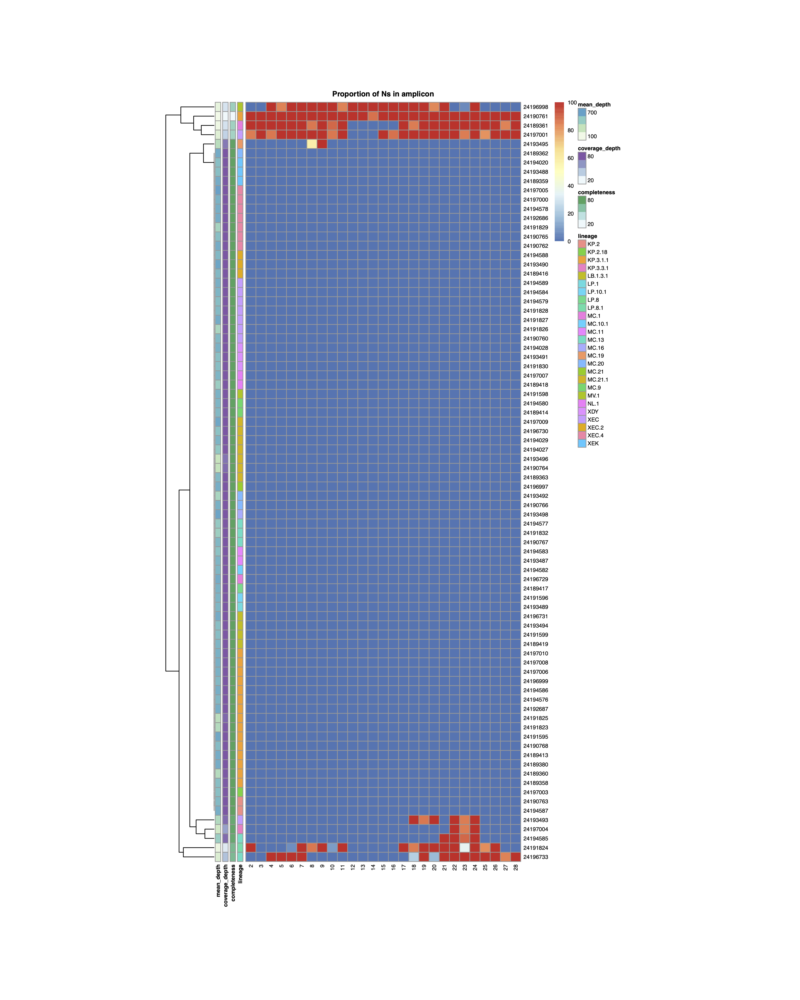

## About sc2_dropout
Snakemake workflow for visualising SARS-CoV-2 amplicon dropout and primer mismatches 

## Required input
1. Primer bed file
2. Sequence metadata 
3. Consensus sequences

## Amplicon dropout heatmap

## Primer mismatches heatmap
